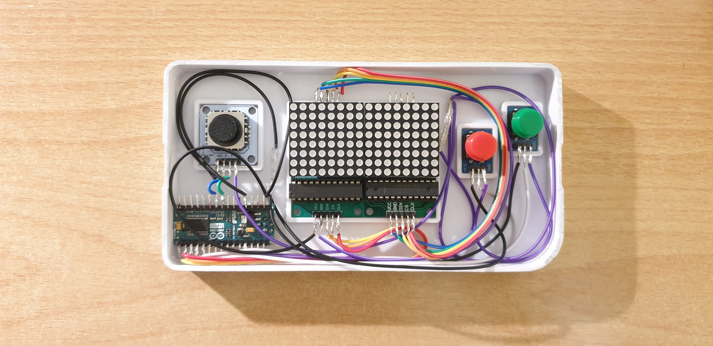

# Game Console

> A homemade portable game console!

- [Introduction](#introduction)
- [Part List](#part-list)
- [Acknowledgement](#acknowledgement)

## Introduction

Have you ever dreamed of building your very own mobile game console? Then this project is for you!

This homemade portable game console is powered by an Arduino Nano, two 8x8 LED dot matrices, a PSP
control stick and two buttons. The system is powered by an external powerbank. All components are
placed inside a custom 3D printed housing. The case was painted with two layers of car paint and
three layers of acrylic paint.

The console features three classic titles: Snake, Space Shooter and Pong. The game library can be
easily expanded.

## Part List

| Component                             | Amount | Link                                           |
|---------------------------------------|--------| ---------------------------------------------- |
| Arduino Nano                          | 1x     | https://store.arduino.cc/products/arduino-nano |
| MAX7219 Dot Matrix Welded             | 2x     | https://www.ebay.de/itm/232975281779           |
| PSP 2-Axis Analog Thumb GAME Joystick | 1x     | https://www.ebay.de/itm/232568553092           |
| 5 Analog Button                       | 1x     | https://www.ebay.de/itm/173458771628           |

Disclaimer: Links may expire in the future. Just make sure it is the same piece.
Some other tools needed to build this project include a soldering iron, a 3D printer,
jumper wires and a breadboard to experiment with.

If you are looking for further instructions, take a look at this amazing video by Sebastian Lague:
https://www.youtube.com/watch?v=TURzbXTNaA0&ab_channel=SebastianLague

## Acknowledgement

Many thanks to Sebastian Lague for his inspiring previous work.
This project builds upon his work and extends it.